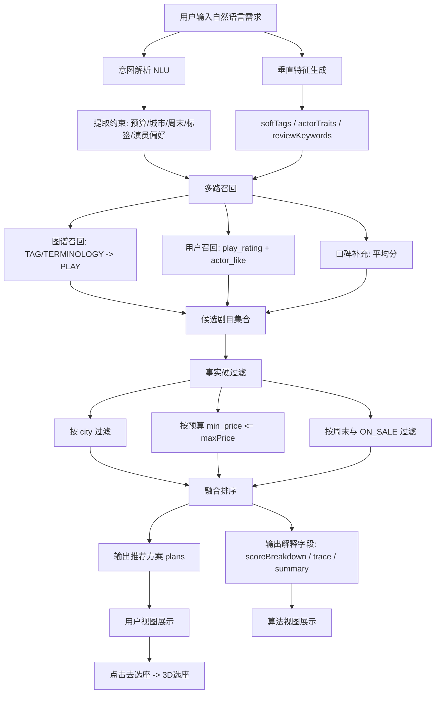

# 知识图谱与推荐算法说明（与当前代码一致）

本文档用于答辩与实现对齐，描述当前项目中**已落地**的推荐算法链路、数据依赖与页面闭环。

---

## 1. 当前算法定位

当前线上实现不是纯图推荐，而是一个可解释的融合流程：

1. 自然语言意图解析（预算 / 城市 / 周末 / 标签 / 演员关注）
2. 垂直特征生成（softTags、actorTraits、reviewKeywords）
3. 多路召回（知识图谱 + 用户偏好 + 评分）
4. 事实硬过滤（真实场次、城市、预算、周末）
5. 融合排序（graph + preference + rating + popularity + rule）
6. 输出结构化推荐（plan + scoreBreakdown + trace + summary）

对应后端主逻辑：

- `springboot/src/main/java/com/example/springboot/service/SmartRecommendationService.java`
- `springboot/src/main/java/com/example/springboot/service/AiPipelineService.java`

---

## 2. 数据模型与依赖表

当前推荐链路实际依赖以下表：

- `knowledge_node`（节点：PLAY / ACTOR / TERMINOLOGY / TAG / VENUE）
- `knowledge_edge`（关系：PERFORMS_IN / HAS_TAG / HAS_TERMINOLOGY / SIMILAR_TO / PERFORMED_AT / WORKS_AT / RELATED_TO）
- `performance`（可售场次与票价）
- `play_rating`（用户对剧目评分）
- `actor_like`（用户喜欢演员）

说明：

- `comment`、`terminology_feedback` 目前不参与主推荐打分，但可用于后续增强。
- 城市过滤依赖 `performance.city`。

---

## 3. 意图解析（NLU）

### 3.1 当前可解析字段

- `maxPrice`：从文本提取数字预算
- `city`：按城市词表识别（已支持北京、上海等）
- `weekendOnly`：是否包含“周末”
- `needActorFocus`：是否强调演员/演技
- `preferredTags`：如话剧、歌剧、芭蕾、爱情、经典、悲剧
- `terms`：如“独白”（由文本关键词触发）

### 3.2 城市识别现状

已由“仅识别北京”升级为“城市词表识别”，因此输入“上海”会生成 `intent.city = 上海`，并参与后续场次过滤。

---

## 4. 多路召回与排序

### 4.1 召回来源

1. **标签召回**：命中 `TAG` 节点后沿图边找 `PLAY`
2. **术语召回**：命中 `TERMINOLOGY` 后找 `PLAY`
3. **用户召回**：
  - 用户历史评分剧目（`play_rating`）
  - 用户喜欢演员关联剧目（`actor_like` + `knowledge_edge`）
4. **口碑补充**：`play_rating` 平均分注入 `ratingScore`

### 4.2 事实过滤

候选剧目必须能匹配真实可售场次（`performance.status = ON_SALE`），并按条件过滤：

- `maxPrice`：`min_price <= budget`
- `city`：`performance.city = intent.city`
- `weekendOnly`：开始时间 >= 最近周六

### 4.3 融合得分

每个候选剧目包含以下分项：

- `graphScore`
- `preferenceScore`
- `ratingScore`
- `popularityScore`
- `ruleScore`

最终按总分排序输出 TopN，并给出 `scoreBreakdown`（可解释）。

---

## 5. AI 页面输出结构（前端两种视图）

### 5.1 用户视图

- 展示“推荐结果 + 时间 + 场馆 + 票价 + 简化理由”
- 一键“去选座”

### 5.2 算法视图

- `intent`
- `verticalFeatures`
- `retrievalSummary`
- `algorithmMetrics`
- `algorithmTrace`
- `ragContext`
- `plans.scoreBreakdown`

这保证了答辩可解释性，同时不牺牲用户视图简洁性。

---

## 6. 闭环链路（当前已打通）

当前可演示闭环：

1. AI 推荐页输入需求并生成方案
2. 点击“去选座”进入 `seat-mode`
3. 再进入 `seat-selection-3d`
4. 展示视角切换、遮挡模拟、座位参考
5. 可回到算法视图讲解推荐过程
6. 再进入知识图谱页展示认知支撑

即：**AI 决策 -> 3D 体验 -> 图谱解释**。

---

## 7. 接口清单（推荐相关）

- `POST /api/ai/chat`：返回完整 AI 推荐流水线结果
- `POST /api/ai/generate-text`：返回垂直文案与特征
- `GET /api/recommendations/play/{playId}`：图谱推荐（按剧目）
- `GET /api/recommendations/actor/{actorId}`：图谱推荐（按演员）
- `GET /api/recommendations/node/{nodeId}`：图谱推荐（通用）
- `GET /api/knowledge-graph/full`：全图
- `GET /api/knowledge-graph/node/{id}/neighborhood`：邻域子图

---

## 8. 当前边界与后续方向

### 当前边界

- 已实现：可解释的融合推荐 + 真实场次约束 + 3D 选座联动
- 未实现：支付、锁座、订单交易闭环

### 后续方向

- 引入更强城市 NLU（同义词/上下文）
- 用 `comment` / `terminology_feedback` 增强偏好建模
- 引入 RecBole（KGAT/KGCN/RippleNet）做离线训练，与当前规则推荐融合

---

## 9. 对答辩可直接使用的一句话

本系统当前采用“意图解析 + 垂直特征 + 图谱与偏好多路召回 + 真实场次硬过滤 + 融合排序”的可解释推荐链路，并已与 3D 选座页面形成完整演示闭环。

---

## 10. 推荐流程图（答辩可直接展示）

---

## 11. 核心知识点白话解释（零基础版）

### 11.1 什么是「垂直特征」？

白话理解：
- 「垂直」= 戏剧这个专业领域（不是泛娱乐）
- 「特征」= 能表达用户偏好的关键词或信号

例如用户说“演技张力强的话剧”，系统不会只记住“话剧”，还会补出：
- `softTags`：柔性标签（如 话剧、悲剧、经典）
- `actorTraits`：演员特征（如 情绪爆发力、舞台张力）
- `reviewKeywords`：评论关键词（如 台词控制力、人物冲突）

作用：让推荐更像“懂戏的人在推荐”，而不是只按剧种筛选。

### 11.2 什么是「多路召回」？

白话理解：
不是只用一种方式找候选剧目，而是“多条路同时找”。

当前有三条主路：
1. 图谱路：通过标签/术语在知识图谱里找相关剧目
2. 用户路：根据用户历史评分与喜欢演员找剧目
3. 口碑路：把剧目平均评分作为补充分

这样做的好处：
- 候选不容易太窄
- 冷启动也能有结果
- 结果更稳

### 11.3 什么是「事实硬过滤」？

白话理解：
前面召回的是“可能合适”，但不一定能买到。硬过滤就是“必须满足现实条件”。

例如：
- 城市必须是上海
- 预算 300 内（`min_price <= 300`）
- 周末场次
- 状态是 `ON_SALE`

不满足就剔除。这样可避免“推荐了但现实不存在”。

### 11.4 什么是「融合排序」？

白话理解：
候选很多时，要综合打分排前后。

系统会结合：
- `graphScore`：图谱关联度
- `preferenceScore`：用户偏好匹配度
- `ratingScore`：口碑评分
- `popularityScore`：命中理由与热度补偿
- `ruleScore`：预算/城市/周末等规则得分

然后输出 TopN 方案。

### 11.5 什么是「可解释推荐」？

白话理解：
不仅告诉你“推荐什么”，还告诉你“为什么”。

例如会展示：
- `scoreBreakdown`（每项分值）
- `algorithmTrace`（召回数量、过滤数量）
- `summary`（系统总结）

这对答辩很重要：老师能看到过程不是黑箱。

### 11.6 什么是「RAG 上下文」？

白话理解：
让系统在生成推荐文案时参考真实事实（场次、票价、城市、场馆），减少乱编。

在你这个项目里，它不是独立大模型平台，而是推荐链路中的“事实约束上下文拼装”。
